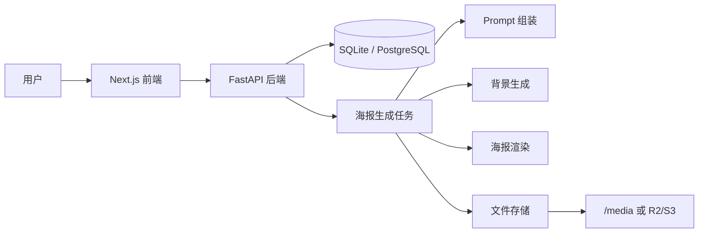

# PosterMind AI

一个面向社交媒体、营销宣传和轻量设计场景的 AI 海报生成原型项目。

项目采用前后端分离架构：

- 后端：FastAPI + SQLAlchemy + Pillow
- 前端：Next.js + React + Tailwind CSS
- 数据库：默认 SQLite，预留 PostgreSQL 配置
- 存储：默认本地 `/media`，预留 R2/S3 对象存储分支
- 任务：当前支持本地异步任务，预留 Celery/Redis 队列能力

> 当前项目更适合作为学习、演示、作品集或二次开发基础。若要上线生产环境，需要先修复权限、安全、依赖和部署一致性问题。

## 项目简介

PosterMind AI 的目标是让用户通过简单输入快速生成海报。

当前支持两种创作方式：

1. **AI 模式**  
   用户输入一句自然语言描述，例如“赛博朋克科技峰会海报”，系统自动生成海报内容与视觉效果。

2. **手动模式**  
   用户手动填写标题、副标题、正文、画布尺寸、主色调等参数，然后生成海报。

适用场景包括：

- 小红书 / Twitter / 社交媒体配图
- 活动宣传海报
- 产品推广图
- 内容运营封面图
- AI 工具作品集展示

## 功能特性

### 已实现功能

- 用户注册、登录、JWT 鉴权
- 海报创建任务
- 海报生成状态轮询
- 海报历史记录查看
- 多种预设风格
- 多种画布比例
- 本地图片生成与保存
- 前端创作工作台
- 历史记录页面
- 管理后台基础页面
- 系统监控基础页面

### 预留 / 未完全完成能力

- Celery + Redis 异步任务队列
- PostgreSQL 部署模式
- Cloudflare R2 / S3 对象存储
- 管理后台增删改操作
- 更完整的 AI 模型接入
- 自动化测试与 CI
- 生产环境安全配置

## 技术栈

### 后端

- Python 3.12
- FastAPI
- Uvicorn
- SQLAlchemy
- Pydantic
- pydantic-settings
- python-jose
- passlib / bcrypt
- Pillow

### 前端

- Next.js 14
- React 18
- TypeScript
- Tailwind CSS
- lucide-react

### 可选基础设施

- Docker
- Docker Compose
- PostgreSQL
- Redis
- Celery
- Cloudflare R2 / S3

## 项目结构

```text
.
├── backend
│   ├── app
│   │   ├── auth.py                 # 认证与 JWT 工具
│   │   ├── config.py               # 后端配置
│   │   ├── database.py             # 数据库初始化与种子数据
│   │   ├── main.py                 # FastAPI 入口
│   │   ├── models                  # SQLAlchemy 模型
│   │   ├── routers                 # API 路由
│   │   ├── schemas                 # Pydantic Schema
│   │   ├── services                # 生成、渲染、存储等服务
│   │   └── tasks                   # 海报生成任务
│   ├── Dockerfile
│   └── requirements.txt
├── frontend
│   ├── app                         # Next.js App Router 页面
│   ├── components                  # 前端组件
│   ├── lib                         # API 与认证封装
│   ├── Dockerfile
│   ├── package.json
│   └── package-lock.json
├── docker-compose.yml
├── .env.example
└── README.md
```

## 架构说明



核心流程：

1. 用户在前端输入海报描述或手动填写内容。
2. 前端调用后端海报生成接口。
3. 后端创建海报任务并写入数据库。
4. 任务模块生成背景图、渲染文字和装饰元素。
5. 生成结果保存到本地媒体目录或对象存储。
6. 前端轮询任务状态并展示最终海报。

## 环境要求

推荐环境：

- Python 3.12+
- Node.js 20 LTS+
- npm 10+

可选：

- Docker / Docker Compose
- PostgreSQL 16
- Redis 7

## 快速开始

当前最推荐使用本地最小模式启动，即：SQLite + 本地图片存储 + 本地后端任务。

### 1. 克隆项目

```bash
git clone https://github.com/yuye96646-art/PosterMind-AI.git
cd PosterMind-AI
```

### 2. 启动后端

macOS / Linux：

```bash
python3.12 -m venv .venv
source .venv/bin/activate

cd backend
pip install -r requirements.txt
uvicorn app.main:app --host 0.0.0.0 --port 8000 --reload
```

Windows PowerShell：

```powershell
py -3.12 -m venv .venv
.\.venv\Scripts\Activate.ps1

cd backend
pip install -r requirements.txt
uvicorn app.main:app --host 0.0.0.0 --port 8000 --reload
```

后端启动后访问：

```text
http://localhost:8000/api/health
```

### 3. 启动前端

新开一个终端：

macOS / Linux：

```bash
cd frontend
npm ci
export NEXT_PUBLIC_API_URL=http://localhost:8000
npm run dev
```

Windows PowerShell：

```powershell
cd frontend
npm ci
$env:NEXT_PUBLIC_API_URL="http://localhost:8000"
npm run dev
```

前端访问：

```text
http://localhost:3000
```

## 环境变量配置

可以参考根目录 `.env.example`。

当前本地最小模式建议配置：

```env
DATABASE_URL=sqlite+aiosqlite:///./postermind.db
SECRET_KEY=please-change-this-secret-key
JWT_ALGORITHM=HS256
JWT_EXPIRE_MINUTES=60
STORAGE_BACKEND=local
REDIS_URL=
```

生产环境请务必修改：

```env
SECRET_KEY=替换为强随机密钥
```

可以用以下命令生成随机密钥：

```bash
python -c "import secrets; print(secrets.token_urlsafe(64))"
```

## Docker Compose 说明

项目包含 `docker-compose.yml`，但当前完整 Compose 模式涉及 PostgreSQL、Redis、Celery、对象存储等配置，仓库中部分依赖和配置尚未完全对齐。

在修复前，不建议直接作为生产部署方式使用。

如果需要尝试：

```bash
cp .env.example .env
docker compose up --build
```

如果启动失败，优先检查：

- `backend/requirements.txt` 是否包含 `asyncpg`
- 是否包含 `celery`
- 是否包含 `boto3`
- `.env` 中数据库地址是否与当前依赖一致
- R2/S3 配置字段是否已经在 `config.py` 中声明

## API 概览

### 认证

| 方法 | 路径 | 说明 |
|---|---|---|
| POST | `/api/auth/register` | 用户注册 |
| POST | `/api/auth/login` | 用户登录 |
| GET | `/api/auth/me` | 获取当前用户信息 |

### 风格 / 模板 / 元素

| 方法 | 路径 | 说明 |
|---|---|---|
| GET | `/api/styles` | 获取风格列表 |
| GET | `/api/templates` | 获取模板列表 |
| GET | `/api/elements` | 获取元素列表 |

### 海报

| 方法 | 路径 | 说明 |
|---|---|---|
| POST | `/api/posters/generate` | 创建海报生成任务 |
| POST | `/api/posters/ai-generate` | AI 模式生成海报内容 |
| GET | `/api/posters/status/{task_id}` | 查询任务状态 |
| GET | `/api/posters/history` | 获取历史记录 |

### 系统

| 方法 | 路径 | 说明 |
|---|---|---|
| GET | `/api/health` | 健康检查 |

## 使用示例

### AI 模式输入示例

```text
赛博朋克科技峰会海报
```

```text
小红书风格美妆促销海报
```

```text
极简主义 AI 产品发布会宣传图
```

### 手动模式输入示例

```text
标题：解锁 AI 生产力新密码
副标题：PosterMind 2026 年度科技峰会
正文：探索 AI 创作、自动化设计与智能营销的新可能
风格：赛博朋克潮流
画布：小红书比例
```

## 已知问题

当前项目仍处于原型阶段，存在以下问题：

### 高优先级

1. 部分用户相关接口需要补充更严格的鉴权和权限校验。
2. 默认管理员账号和前端自动登录逻辑不适合生产环境。
3. JWT 默认密钥需要改为强随机密钥。
4. Token 当前存储在浏览器 localStorage 中，存在 XSS 风险。
5. `.env.example`、`docker-compose.yml`、`config.py` 和 `requirements.txt` 存在配置漂移。

### 中优先级

1. 历史记录查询存在 N+1 查询风险。
2. 无 Redis 时使用本地异步任务，任务不具备持久化能力。
3. R2/S3 对象存储分支需要补齐配置字段和依赖。
4. 前端部分 UI 参数尚未真正传递到后端生成链路。
5. 管理后台部分按钮仍是占位功能。
6. 当前缺少自动化测试和 CI。

## 建议修复顺序

1. 移除默认管理员自动登录逻辑。
2. 为所有用户资源接口补齐鉴权。
3. 强制使用强随机 `SECRET_KEY`。
4. 统一 `.env.example`、`config.py`、`requirements.txt` 和 `docker-compose.yml`。
5. 补充基础测试。
6. 添加 GitHub Actions CI。
7. 完善管理后台。
8. 再考虑生产部署和对象存储。

## 开发命令

### 后端检查

```bash
cd backend
python -m compileall app
```

### 前端检查

```bash
cd frontend
npm run lint
npm run build
```

## 推荐 GitHub Topics

可以在 GitHub 仓库设置中添加：

```text
ai
poster-generator
fastapi
nextjs
react
tailwindcss
pillow
image-generation
portfolio-project
```

## 开发计划

- [ ] 修复权限校验问题
- [ ] 移除默认管理员自动登录
- [ ] 统一环境变量和依赖配置
- [ ] 补齐 Celery / Redis 任务模式
- [ ] 补齐 R2/S3 存储配置
- [ ] 增加后端单元测试
- [ ] 增加前端构建检查
- [ ] 添加 GitHub Actions
- [ ] 完善管理后台 CRUD
- [ ] 增加真实 AI 模型接入
- [ ] 增加部署文档

## 贡献指南

欢迎提交 Issue 或 Pull Request。

建议提交前先执行：

```bash
cd backend
python -m compileall app
```

```bash
cd frontend
npm run lint
npm run build
```

提交 PR 时请说明：

- 修改目的
- 影响模块
- 是否涉及数据库结构变化
- 是否涉及安全或权限逻辑
- 是否需要新增环境变量

## License

当前仓库暂未提供 LICENSE 文件。

如果项目用于开源展示，推荐添加以下许可证之一：

- MIT License：适合个人项目、作品集、快速传播
- Apache-2.0 License：适合更正式的团队协作或商业化扩展

## 免责声明

本项目当前主要用于学习、演示和作品集展示。  
如果用于生产环境，请先完成安全、权限、依赖、测试和部署一致性修复。
